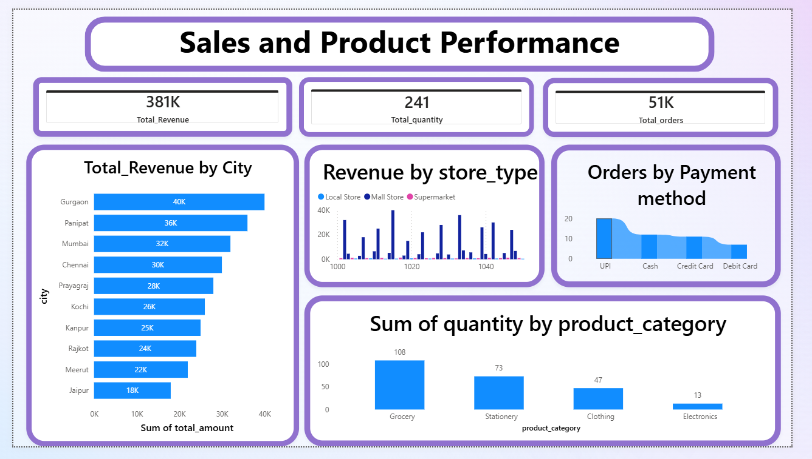
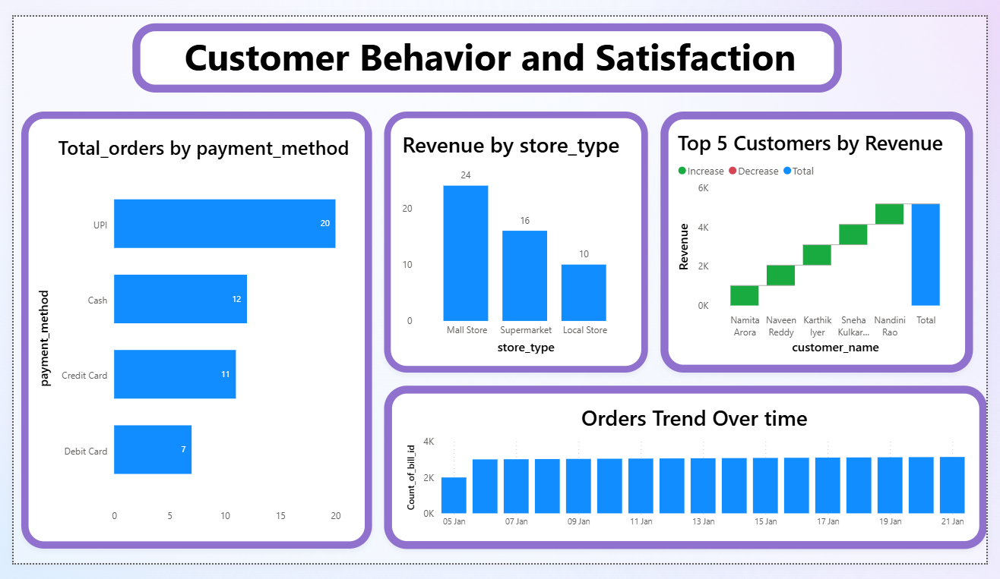

# Retail Sales Analysis — India 🛒

## Project Overview
Analyzed India retail sales data to find key business 
insights using Power BI.

## Problem Statement
Understanding sales performance, customer behavior 
and product trends across Indian cities.

## Tools Used
- Power BI
- Microsoft Excel
- Power Query

## Dataset
- Source: Kaggle
- Records: 1000+ rows
- Time Period: January 2026

## Key Insights
- Gurgaon has highest revenue at 40K
- UPI is most popular payment method (20 orders)
- Grocery is top selling category (108 units)
- Mall Stores generate highest revenue
- Orders peaked after January 7

## Dashboard Pages
### Page 1 — Sales and Product Performance
- Total Revenue: 381K
- Total Quantity: 241
- Total Orders: 51K
- Revenue by City
- Revenue by Store Type
- Orders by Payment Method
- Quantity by Product Category

### Page 2 — Customer Behavior and Satisfaction
- Orders by Payment Method
- Revenue by Store Type
- Top 5 Customers by Revenue
- Orders Trend Over Time

## Screenshots

## How to Use
1. Download the .pbix file
2. Open in Power BI Desktop
3. Explore the interactive dashboard
